# Lab5 RNAfold and Riboswitches

## Overview

The aim of this lab is to run RNAfold package to obtain secondary structures of folded RNA.
The inputs are nucleic sequences and possibly constraints. All sequences and riboswitch scenarios were obatined from the paper written 
by Penchovsky and	Breaker.

<br>

## Understanding the Paper

**_Q:_** Will	the	AND-1	riboswitch	cleave	itself	when	both	of	its	OBS	are	bound?

**_A:_** Yes it will. If both OBS are bound, that means both the inputs to the AND gate are **TRUE**. The output should therefore be **TRUE**. The regions responsible for self-cleavage are aligned and bound to each other. The riboswitch will cleave itself.


**_Q:_** Will	the	OR-1	riboswitch	cleave	itself	when	neither	of	its	OBS	are	bound?

**_A:_** No it won't. If neither of the OBS are bound, that means both the inputs to the OR gate are **FALSE**. The output should therefore be **FALSE**. The regions resposible for self-cleavage are not exactly bound to each other. The riboswitch will not cleave itself.

**_Q:_** What	behavior	do	we	expect	from	the	YES-1	riboswitch?

**_A:_** If the OBS is bound, that means the input of the YES gate is **TRUE**. The output should be **TRUE** as well. The riboswitch cleaves itself.

If the OBS is not bound, that means the input of the YES gate is **FALSE**. The output should be **FALSE** as well. The riboswitch does not cleave itself.

<br>

## Grabbing the Sequences

All information obtained from the sequence is summarized into the table below:

| Riboswitch name | Start OBS-1  | End OBS-1 | Start OBS-2 | End OBS-2 | Start red1 | End red1 | Start red2 | End red2 |Sequence|
|------|------|------|------|------|------|------|------|------|------|
|   YES-1 | 26|47|N/A|N/A|16|21|49|54|GGGCGACCCUGAUGAGCUUGAGUUUAGCUCGUCACUGUCCAGGUUCAAUCAGGCGAAACGGUGAAAGCCGUAGGUUGCCC|
|   NOT-1  | 44|66|N/A|N/A|40|43| 74|77|GGCAGGUACAUACAGCUGAUGAGUCCCAAAUAGGACGAAACGCGACACACACCACUAAACCGUGCAGUGUUUUGCGUCCUGUAUUCCACUGC|
|   AND-1 |30|45|49|64|16|23|70|77|GGGCGACCCUGAUGAGCUUGGUUUAGUAUUUACAGCUCCAUACAUGAGGUGUUAUCCCUAUGCAAGUUCGAUCAGGCGAAACGGUGAAAGCCGUAGGUUGCCCAGAGACAAU|
|OR-1 |27|46|47|66|16|26|67|77|GGGCGACCCUGAUGAGCUUGGUUGAGUAUUUACAGCUCCAUACAUGAGGUGUUCUCCCUACGCAAGUUCGAUCAGGCGAAACGGUGAAAGCCGUAGGUUGCCC|

<br>

## Routine to fold RNA

The developed routine is shown below. We first import subprocess. When calling subprocess, we simply call the RNAfold function and use
the sequences as input in the form of ASCII characters. Terminal output and outputfile are implemented seperately.

```
import subprocess
seqs = \
""">YES-1
GGGCGACCCUGAUGAGCUUGAGUUUAGCUCGUCACUGUCCAGGUUCAAUCAGGCGAAACGGUGAAAGCCGUAGGUUGCCC
>NOT-1
GGCAGGUACAUACAGCUGAUGAGUCCCAAAUAGGACGAAACGCGACACACACCACUAAACCGUGCAGUGUUUUGCGUCCUGUAUUCCACUGC
>AND-1
GGGCGACCCUGAUGAGCUUGGUUUAGUAUUUACAGCUCCAUACAUGAGGUGUUAUCCCUAUGCAAGUUCGAUCAGGCGAAACGGUGAAAGCCGUAGGUUGCCCAGAGACAAU
>OR-1
GGGCGACCCUGAUGAGCUUGGUUGAGUAUUUACAGCUCCAUACAUGAGGUGUUCUCCCUACGCAAGUUCGAUCAGGCGAAACGGUGAAAGCCGUAGGUUGCCC
>@
"""

p = subprocess.run(['RNAfold'],
                   input=bytes(seqs,'ascii'),
                  stdout=subprocess.PIPE,
                  stderr=subprocess.PIPE)

print("*** Terminal output ***")
print(p.stderr.decode())

print("*** Output file ***")
print(p.stdout.decode())
```

<br>

## The meat of the assignment

<br>

### (1) Default parameters and the effect of temperature

With default parameters (please see ipython file for detailed codes), we obtained the following configurations.


##### YES-1

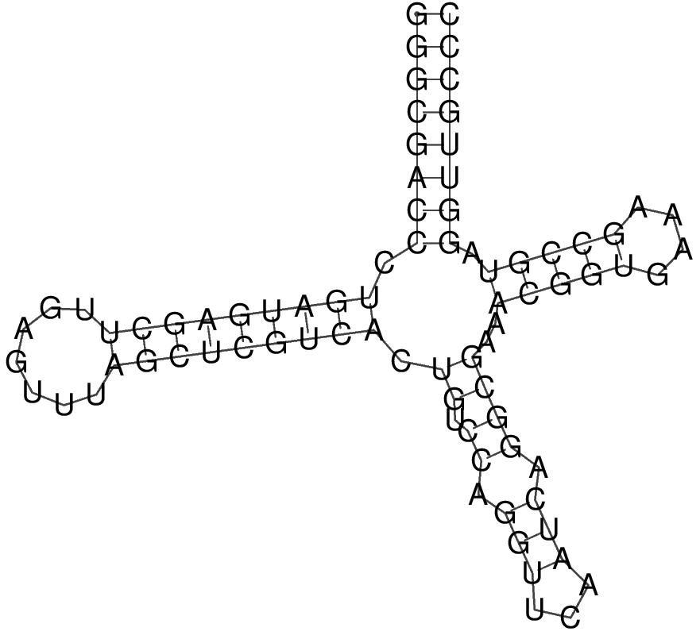


##### NOT-1

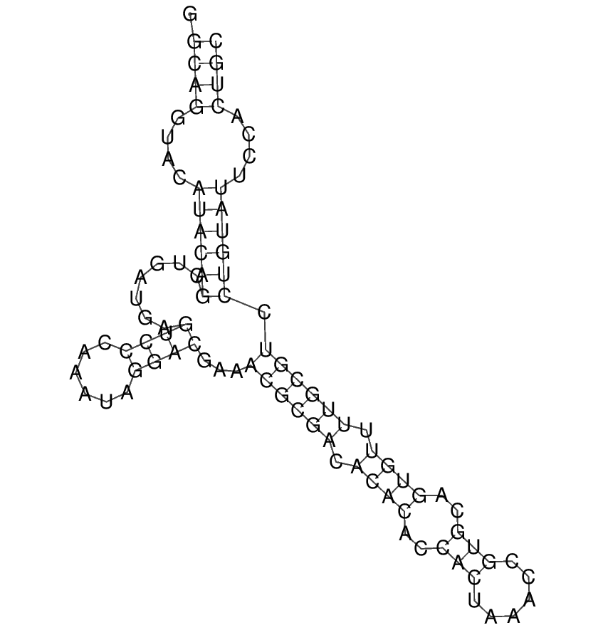


##### AND-1


##### OR-1

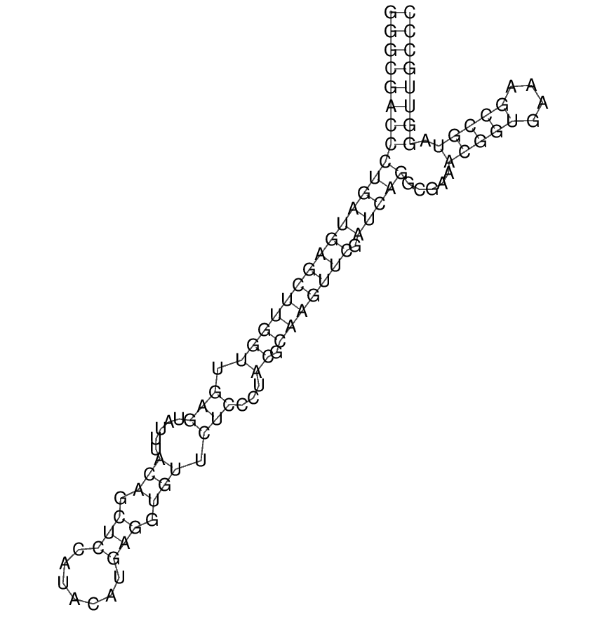


**Discussion:** The obtained RNA plots are identical to those obtained by Penchovsky & Breaker for the NOT-1, AND-1 and OR-1. For YES-1 however, the obtained structure has 4 stem loops instead of 3. The paper's results can be replicated by reducing the temperature to 5°C as shown below.

By changing the temperature using the following code, the RNA folding configuration can be changed.

```
p = subprocess.run(['RNAfold', '--temp=5'],
                   input=bytes(seqs,'ascii'),
                  stdout=subprocess.PIPE,
                  stderr=subprocess.PIPE)
```
##### YES-1 at T = 5°C

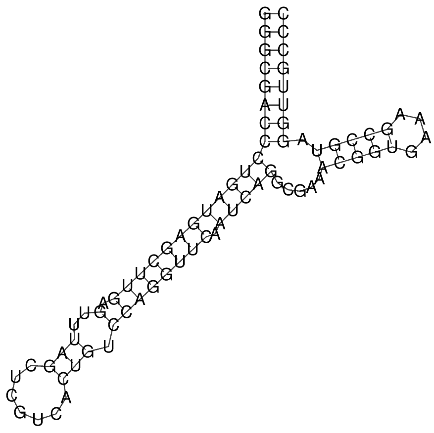

In order to keep the outside conditions unchanged, we used default temperature parameters in the rest of this lab.

<br>

### (2) OBS binding to YES-1 and NO-1

To automate the constraint generating process, and since the OBS positions have already been identified in the beginning of this lab, we use the following code as a template to simulate RNA folding in all binding conditions.

```
seq = "GGGCGACCCUGAUGAGCUUGAGUUUAGCUCGUCACUGUCCAGGUUCAAUCAGGCGAAACGGUGAAAGCCGUAGGUUGCCC"
bstart = 26
bend = 47
end = len(seq)

string = ">YES-1_T\n" +seq+"\n"

for i in range(bstart):
    string += "."    
for i in range(bstart, bend+1):
    string += "x"    
for i in range(bend+1, end):
    string += "." 

string += "\n>@"
    
p = subprocess.run(['RNAfold', '-C'],
                       input=bytes(string, 'ascii'),
                      stdout=subprocess.PIPE,
                      stderr=subprocess.PIPE) 
```

The codes are self-explanatory. The input is the sequence of the RNA followed by the '.x' constraint. With the -C parameters added, the RNAfold function will generate the RNA folding configurations under the constraint conditions, i.e. in the presence of OBS.


Here are the results:


#### YES-1 constrained folding

>YES-1_T
GGGCGACCCUGAUGAGCUUGAGUUUAGCUCGUCACUGUCCAGGUUCAAUCAGGCGAAACGGUGAAAGCCGUAGGUUGCCC
((((((((.......((((((...........................))))))...(((((....))))).)))))))) (-24.50)

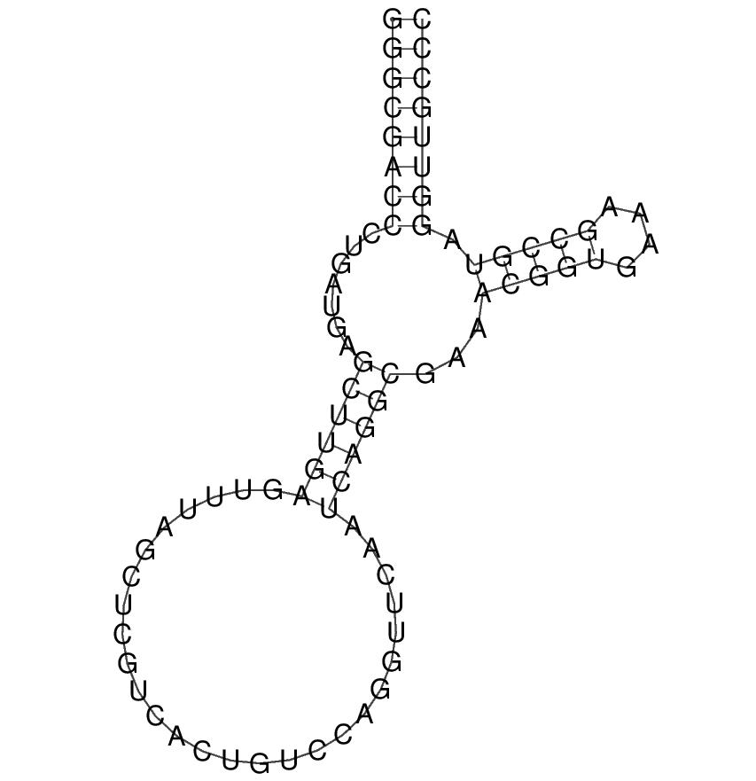


#### NOT-1 constrained folding

>NOT-1_T
GGCAGGUACAUACAGCUGAUGAGUCCCAAAUAGGACGAAACGCGACACACACCACUAAACCGUGCAGUGUUUUGCGUCCUGUAUUCCACUGC
.((((....((((((..((((.((((......))))(((((...........................))))).))))))))))....)))) (-16.00)

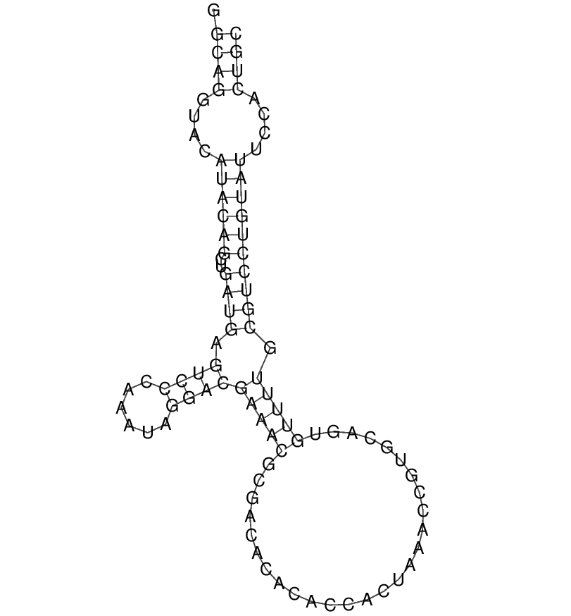

<br>

**Discussion:** For YES-1 riboswitch, the RNA configurations are exactly the same with and without constraint. If the OBS is bound, that means the input of the YES gate is **TRUE**. The output is **TRUE** as well. The riboswitch cleaves itself. If the OBS is not bound, that means the input of the YES gate is **FALSE**. The output is **FALSE** as well. The riboswitch does not cleave itself. We therefore can generate the truth table as below.


#### YES-1 truth table


|Input|Output|
|------|------|
|0|0|
|1|1|

<br>
for not-1 riboswitch, the RNA folding result without constraint is the same with the paper as previously showed. However, when it comes to constraint case, a pair of GU and a pair of CG are missing at position 42-43, 67-68. Despite this, the two red regions are still not aligned, and the output is still **FALSE**. We therefore can generate the truth table as below.
<br>

#### NOT-1 truth table


|Input|Output|
|------|------|
|0|1|
|1|0|

<br>

### (3) OBS binding to AND-1 and OR-1

Using the same template and parameters (detailed codes please see the ipython file), we generated the RNA folding of AND-1 and OR-1 in T/F, F/T, and T/T situations respectively. Here are the results:

#### AND-1 OBS-1 bound alone

>AND-1_TF
GGGCGACCCUGAUGAGCUUGGUUUAGUAUUUACAGCUCCAUACAUGAGGUGUUAUCCCUAUGCAAGUUCGAUCAGGCGAAACGGUGAAAGCCGUAGGUUGCCCAGAGACAAU
((((((((((((((((((((..........................(((.(....))))...))))))).))))).....(((((....))))).))))))))......... (-33.90)

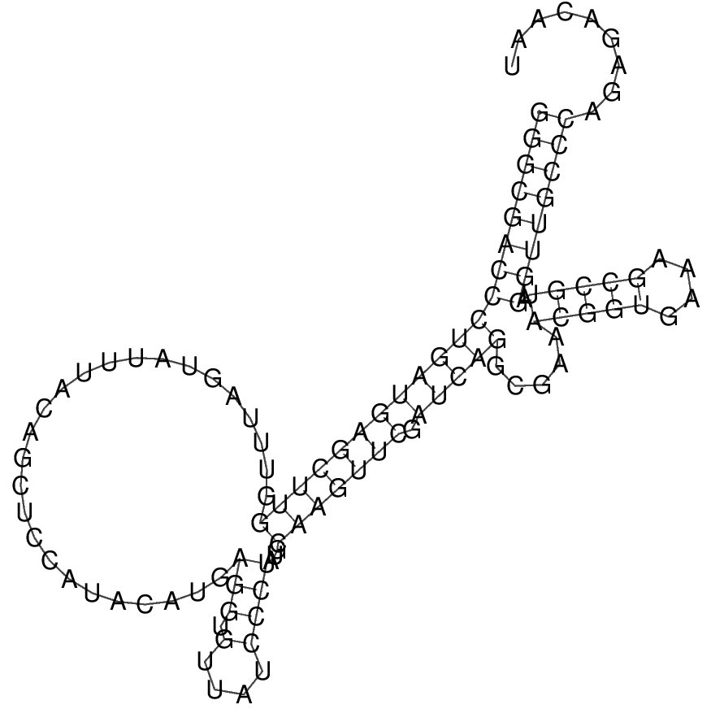


##### AND-1 OBS-2 bound alone

>AND-1_FT
GGGCGACCCUGAUGAGCUUGGUUUAGUAUUUACAGCUCCAUACAUGAGGUGUUAUCCCUAUGCAAGUUCGAUCAGGCGAAACGGUGAAAGCCGUAGGUUGCCCAGAGACAAU
((((((((((.(((....(((...(((.......))))))..))).))..................((((......))))(((((....))))).))))))))......... (-28.30)

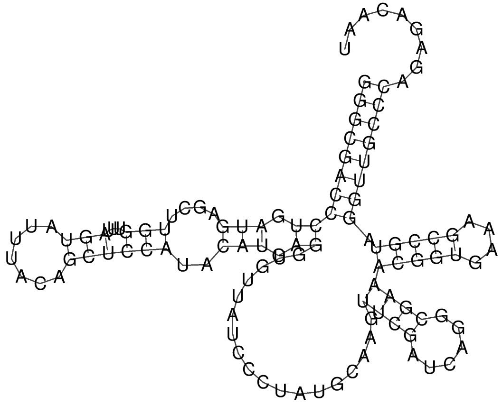


##### AND-1 OBS-1 and OBS-2 both bound

>AND-1_TT
GGGCGACCCUGAUGAGCUUGGUUUAGUAUUUACAGCUCCAUACAUGAGGUGUUAUCCCUAUGCAAGUUCGAUCAGGCGAAACGGUGAAAGCCGUAGGUUGCCCAGAGACAAU
(((((((((((((((((................................................)))).))))).....(((((....))))).))))))))......... (-26.30)


<br>

**Discussion:** For AND-1 riboswitch, four situations are discussed:
FF: Exactly the same with the paper. Both blue areas are not bound, the red areas are not aligned, the riboswitch does not undergo cleavage.

TF: The configurations are similar to that in the paper with the exception of the formation of a slighly different stem involving nucleotides 46 to 60 whereas in the paper nucleotides 58-60 link to 24-26. Interestingly, our configuration seems more energetically favourable as it has one additional base pair and includes more G-C pairings. Different quantifications of entropy in the two alogorithms could explain this result.  In both configurations (paper and ours), the two red regions are not aligned. The ouput is false and the riboswitch does not undergo cleavage.

FT: This case varies significantly from the configuration given in the paper. For example, at position 10-40 and 65-80. However, the two red regions are still not aligned and the result is false in both cases.

TT: Exactly the same as in the paper. Both blue areas are bound, the red areas are aligned and bound, the riboswitch will undergo cleavage. The ouput is true in this case.

We therefore can generate the truth table as below.

<br>

#### AND-1 truth table

|Input 1|Input 2|Output|
|------|------|------|
|0|0|0|
|1|0|0|
|0|1|0|
|1|1|1|


<br>

#### OR-1 OBS-1 bound alone

>OR-1_TF
GGGCGACCCUGAUGAGCUUGGUUGAGUAUUUACAGCUCCAUACAUGAGGUGUUCUCCCUACGCAAGUUCGAUCAGGCGAAACGGUGAAAGCCGUAGGUUGCCC
((((((((((((((((((((((.(((...........................)))...)).))))))).))))).....(((((....))))).)))))))) (-34.20)

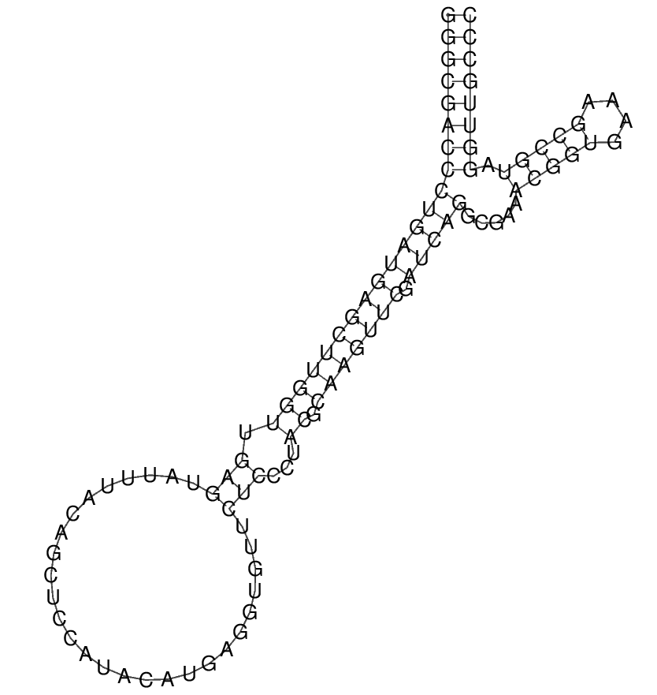


##### OR-1 OBS-2 bound alone

>OR-1_FT
GGGCGACCCUGAUGAGCUUGGUUGAGUAUUUACAGCUCCAUACAUGAGGUGUUCUCCCUACGCAAGUUCGAUCAGGCGAAACGGUGAAAGCCGUAGGUUGCCC
((((((((.......((((((((((..........................................))))))))))...(((((....))))).)))))))) (-28.84)

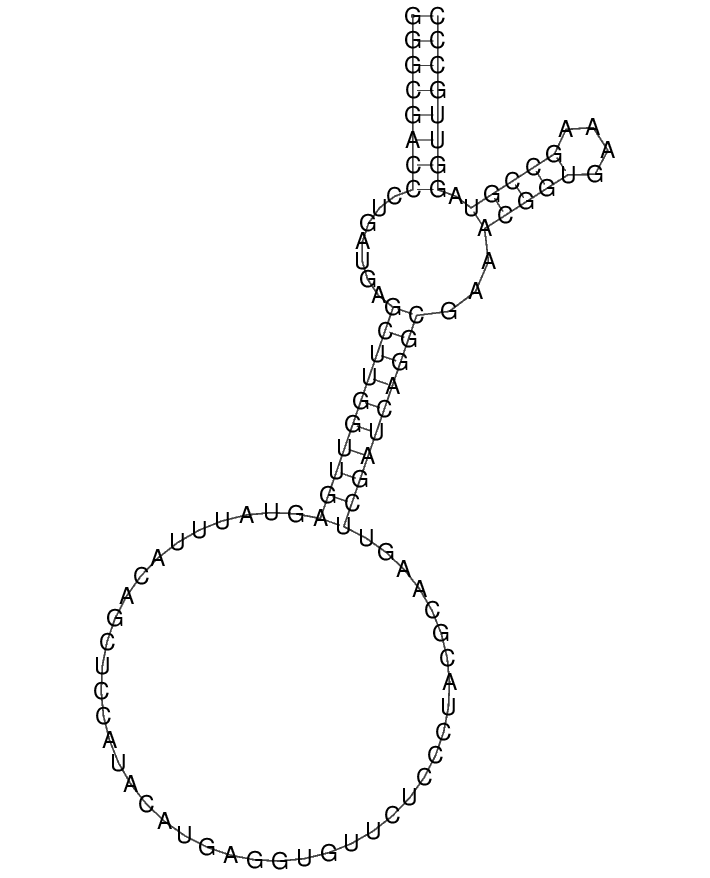


##### OR-1 OBS-1 and OBS-2 both bound

>OR-1_TT
GGGCGACCCUGAUGAGCUUGGUUGAGUAUUUACAGCUCCAUACAUGAGGUGUUCUCCCUACGCAAGUUCGAUCAGGCGAAACGGUGAAAGCCGUAGGUUGCCC
((((((((.......((((((((((..........................................))))))))))...(((((....))))).)))))))) (-28.84)

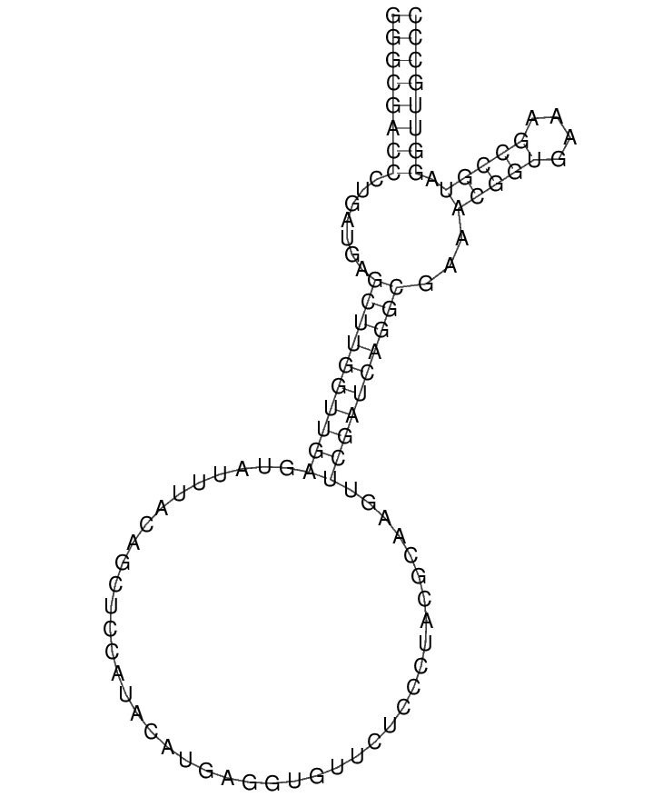


<br>

**Discussion:** For OR-1 riboswitch, four situations are discussed:
FF: Exactly the same with the paper. Both blue areas are not bound, the red areas are not aligned, the riboswitch does not undergo cleavage.

TF: The results vary significantly from the paper with some stem loops not appearing. In addition, the two red regions are not aligned at all. This seems to be the result of a shift in the base pairing in one of the stems. The same number of base pairs are formed in both cases. However, our results have no non canonical base pairing (although this was not a specified constraint). This increased in energy comes at the cost of entropy via the formation of bulges in our result. Overall, because the red regions are not aligned in our case, the corresponding output result is likely to be false, unlike what is announced in the paper.

FT: The configuration is slightly different than that obtained in the paper. There is a slight shift with part of the second blue region being involved in binding in our case. This induces a slight shift in the matching of the red regions. Consequently, the output we are likely to obtain is false, in contradiction with the paper's analysis.

TT: The obtained result is identical to that in the paper with the exception that our results do not pair nucleotides 26 and 67. In the paper this is a non-canonical GU base pairing. The low energy of such a pairing means both results are highly similar and the structure may easily transition from one to the other. Regardless, the ouput in this case is true as expected.

We therefore can generate the truth table as below.
<br>

#### OR-1 truth table obtained in our simulations
The table does not match the desired outcome as explained above, probably due to different quantification of entropy loss in constrained structures.

|Input 1|Input 2|Output|
|------|------|------|
|0|0|0|
|1|0|0|
|0|1|0|
|1|1|1|


<br>

## Final Question: According to your results, do the riboswitches work as the paper claims?

If we neglect the different configurations and only focus on the red regions' alignment, three riboswitches work as the paper claims: YES-1, NOT-1, and AND-1. The TF and FT situations in OR-1 gate do not work as claimed.

Both the change in configurations and the different output in OR-1 riboswitch can probabaly be explained by the different parameters in the RNAfold function. As can be seen in the document, a number of parameters including temperature can be adjusted. They can all lead to different RNA folding configurations. Furthermore, entropy cost associated with bulges and stems might differ. One key take-out message is that in order to guarantee the reproductibility of results, specification of technical details such as parameters should be given.
