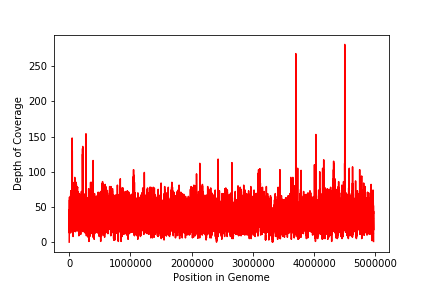
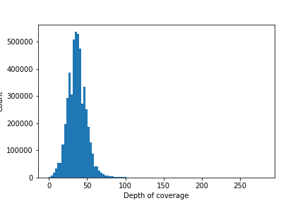
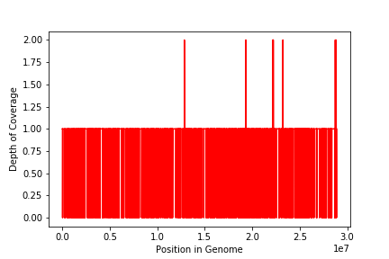
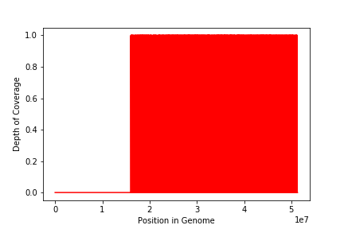
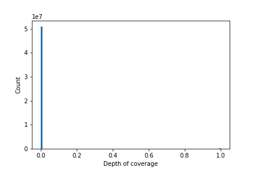
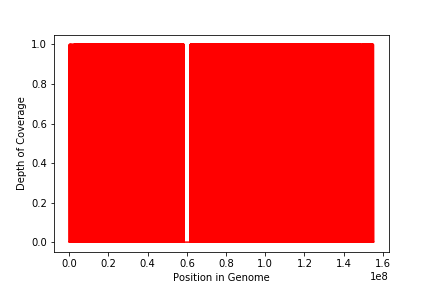
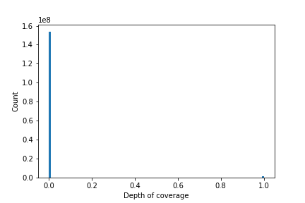
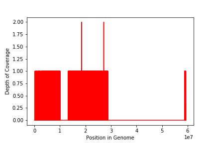
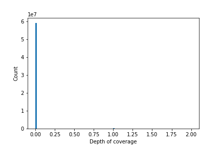
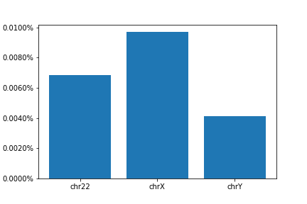

# Lab 6 - sequence alignment mapping

## Overview

The aim of this lab is to run the bowtie analysis on strains of _Shewanella oneidensis_. The readings might have been contaminated by the experimentor (Jamie) during the run on the Illumina MiSeq. We will account for this contamination and extract key metrics to compare our strain of _Shewanella_ to a reference genome.

**NOTE: All of the data files for this analysis can be found on our [server](https://bioe131.com/user/be131-09/tree/GIT/Computational-Biology/Lab6). They were not uploaded to GitHub due to their large file size.

<br>

## Aligning reads to the human reference genome
### Very fast bowtie analysis

**_Q:_** What will you use for the database? Input reads? If you use the --un unaligned.fastq option, what will unaligned.fastq contain?

**_A:_** To map the reads  to the human genome and remove any contamination we use the human genome as database and the illumina reads as input. The unaligned.fastq option will provide all the reads that could not be aligned to the human genome, i.e. the uncontaminated data.

The bowtie algorithm was run from the terminal using the following input.

Input:
```
be131-09@meowth:~$ bowtie2 -p 4 --very-fast --no-unal -x /data/hg19/hg19 -U /data/lab6/illumina_reads.fastq -S Lab6/Alignments/human_vfast.sam --un Lab6/Alignments/unaligned_human_vfast.fastq
```

Output:
```
1124714 reads; of these:
  1124714 (100.00%) were unpaired; of these:
    1028379 (91.43%) aligned 0 times
    87274 (7.76%) aligned exactly 1 time
    9061 (0.81%) aligned >1 times
8.57% overall alignment rate
```

**_Q:_** What percentage of your sequencing library came from contaminating human DNA?

**_A:_** The analysis shows that 8.57% of the sequencing library came from human DNA which suggests that there was some contamination by one of the experimenter.

<br>

## Aligning reads to the _S. oneidensis_ reference genome
### Very fast bowtie analysis
The bowtie analysis for Shewanella is completed in the same manner as that of the human genome.

Input:
```
be131-09@meowth:~/Lab6$ bowtie2 -p 4 --very-fast --no-unal -x /data/lab6/shewanella_oneidensis_mr-1 -U ~/Lab6/Alignments/unaligned_human_vfast.fastq -S ~/Lab6/Alignments/shewanella_vfast.sam --un ~/Lab6/Alignments/unaligned_shewanella_vfast.fastq
```

Output:
```
1028379 reads; of these:
  1028379 (100.00%) were unpaired; of these:
    299560 (29.13%) aligned 0 times
    687571 (66.86%) aligned exactly 1 time
    41248 (4.01%) aligned >1 times
70.87% overall alignment rate
```

### Very sensitive bowtie analysis

Input:
```
be131-09@meowth:~/Lab6$ bowtie2 -p 4 --very-sensitive --no-unal -x /data/lab6/shewanella_oneidensis_mr-1 -U ~/Lab6/Alignments/unaligned_human_vfast.fastq -S ~/Lab6/Alignments/shewanella_vsensitive.sam --un ~/Lab6/Alignments/unaligned_shewanella_vsensitive.fastq
```

Output:
```
1028379 reads; of these:
  1028379 (100.00%) were unpaired; of these:
    298112 (28.99%) aligned 0 times
    688180 (66.92%) aligned exactly 1 time
    42087 (4.09%) aligned >1 times
71.01% overall alignment rate
```

**_Q:_** If you use the --un unaligned.fastq option, what will unaligned.fastq contain?

**_A:_** The unaligned.fastq file will contain reads that couldn't be aligned with the shewanella reference genome. This can be reads from other sources of contamination or even reads linked to human contamination that were not detected in the previous iteration of the bowtie algorithm.


**_Q:_** What percentage of your filtered library didn’t align to the reference genome? If you use --verysensitive
instead of --very-fast, does this percentage increase or decrease?

**_A:_** In the very fast bowtie analysis, 29.13% of the filtered sequence did not align to the _S. oneidensis_ reference genome. Using the very sensitive option decreases this percentage to 28.99%. The execution runtime is longer in the sensitive mode but shorter alignment sequences can be identified. Interestingly, the reduced rate suggests the number of mismatches in the fast analysis is limited.

<br>

## Generate a coverage plot with the _S. oneidensis_ reference genome

```
be131-09@meowth:~/Lab6$ samtools view -b Alignments/shewanella_vsensitive.sam > Coverage_Plot/shewanella_vsensitive.bam
be131-09@meowth:~/Lab6$ samtools sort Coverage_Plot/shewanella_vsensitive.bam > Coverage_Plot/shewanella_vsensitive.sorted.bam
be131-09@meowth:~/Lab6$ samtools index Coverage_Plot/shewanella_vsensitive.sorted.bam
be131-09@meowth:~/Lab6$ samtools depth -a Coverage_Plot/shewanella_vsensitive.sorted.bam > Coverage_Plot/shewanella_pileup.tab
```
The analysis of the pileup is conducted in Python.

**_Q:_** What is the min, max, and mean coverage across all positions?

**_A:_** Here are the results of our analysis in Python.

```
Maximum coverage =  281
Minimum coverage =  0
Average coverage = 37.04
```

### Coverage depth as a function of position


The coverage is not uniform and some regions have far higher coverage than average (for instance around position 3,700,000).

### Coverage depth distribution
We then plotted the coverage depth distribution using the built in histogram function in the matplolib library.



The coverage depth distribution seems to follow an extreme value (Gumbel) distribution. The most informational positions are those with coverage larger than 100, after the tail.

<br>

## Extra credit 1 - Generate a coverage plot with the Human genome

Generating a pileup for the human genome.
/!\ We do not use the -a output option when generating the pileup file to avoid positions with zero depth. If we were to use it we would create a file of more than 50GB.
```
be131-09@meowth:~/Lab6$ samtools view -b Alignments/human_vfast.sam > Coverage_Plot_human/human_vfast.bam
be131-09@meowth:~/Lab6$ samtools sort Coverage_Plot_human/human_vfast.bam > Coverage_Plot_human/human_vfast.sorted.bam
be131-09@meowth:~/Lab6$ samtools index Coverage_Plot_human/human_vfast.sorted.bam
be131-09@meowth:~/Lab6$ samtools depth Coverage_Plot_human/human_vfast.sorted.bam > Coverage_Plot_human/human_pileup.tab
```

The pileup file was analysed in the Jupyter notebook.

### Coverage depth as a function of position
Here we plotted the coverage depth as a function of position in the human pileup file. Positions with no coverage do not all appear here. **The position indicated in the graph does not correspond to the position in the genome.**


```
Maximum coverage =  2
Minimum coverage =  0
```

### Coverage distribution
The coverage distribution was plotted. Positions with no coverage do not all appear here so this graph should only be used to compare the distribution of non-zero coverage.


### Analysis
There is very little coverage of the human genome compared with Shewanella. The maximum coverage depth is only 2 despite 8.57% of the sequencing library came from human DNA. 

## Extra credit 1 - Average depth of coverage for specific chromosomes
Extracting reads for a single chromosome from BAM file with samtools
```
be131-09@meowth:~/Lab6/Coverage_Plot_human$ samtools view -b human_vfast.sorted.bam chr22 > human_vfast.sorted.chr22.bam
be131-09@meowth:~/Lab6/Coverage_Plot_human$ samtools view -b human_vfast.sorted.bam chrX > human_vfast.sorted.chrX.bam
be131-09@meowth:~/Lab6/Coverage_Plot_human$ samtools view -b human_vfast.sorted.bam chrY > human_vfast.sorted.chrY.bam
```

Generate list of coordinates in chromosomes 22, X and Y and the number of times read aligned to that position
```
be131-09@meowth:~/Lab6/Coverage_Plot_human$ samtools depth -a human_vfast.sorted.chr22.bam > human_pileup_chr22.tab
be131-09@meowth:~/Lab6/Coverage_Plot_human$ samtools depth -a human_vfast.sorted.chrX.bam > human_pileup_chrX.tab
be131-09@meowth:~/Lab6/Coverage_Plot_human$ samtools depth -a human_vfast.sorted.chrY.bam > human_pileup_chrY.tab
```

### Chromosome 22
#### Coverage depth as a function of position


```
# Coverage statistics being calculated
Maximum coverage =  1
Minimum coverage =  0
Average coverage = 0.007
```

#### Coverage distribution


### Chromosome X
#### Coverage depth as a function of position


```
Maximum coverage =  1
Minimum coverage =  0
Average coverage = 0.010
```

#### Coverage distribution


### Chromosome Y
#### Coverage depth as a function of position


```
Maximum coverage =  1
Minimum coverage =  0
Average coverage = 0.004
```

#### Coverage distribution


### Comparing average coverage depth
The average depth for each chromosome was plotted in a bar chart. The coverage percentage was given with greater precision than in the previous iteration.

```
CALCULATING AVERAGE FOR chr22
Average depth of coverage in chr22 : 0.6868%

---------------------------------------------------------------------

CALCULATING AVERAGE FOR chrX
Average depth of coverage in chrX : 0.9715%

---------------------------------------------------------------------

CALCULATING AVERAGE FOR chrY
Average depth of coverage in chrY : 0.4118%
```




### Analysis
All three chromosomes have a low average coverage (less than 1%), with chromosome Y having the lowest. However, chromosome Y has the maximum coverage depth (2). This suggests some of the human DNA found in the provided sequence reads comes from an individual with a Y chromosome (rather than this match just occuring by chance). This would mean Jamie is a man. This is confirmed in the second part of our analysis (see Extra credit 2 - Zooming in on high coverage regions).

Interestingly, much like with the _S. oneidensis_ reference genome, the coverage of all three chromosomes is not uniform either. For instance, the first 15 million positions of chromosome 22 do not show any coverage.

<br>

## Extra credit 2 - Zooming in on high coverage regions
We further analysed the pileup files in our Jupyter notebook to identify regions with a higher than average coverage. Two regions of interest in chrY were identified: (18485047-18485210), (27170225-27170466). The sequences were viewed with samtools and identified using BLAST.

### chrY:18485047-18485210
```
be131-09@meowth:~/Lab6$ samtools view Coverage_Plot_human/human_vfast.sorted.bam "chrY:18485047-18485210"
read524540      0       chrY    18484909        1       300M    *       0       0       TACATTTTATGCAATCAACTTTTTTACGTGTGTGTATCTGTAGTTTCATTTCTGTGGTGATGAGTGAGACAGGTGTGGAGTAAATCAGTCCATTACATTCTTTTCTAGGTTACTTGAATTTGACATCTCAGTTCAGCATTGTAAACTCTTACAATGAACTCATAAAGTTAGAACAACGTTAAAAATAATTGCTATCTAAGTATCAGAGTTAGAATAAATTATTCCCAAGGTTTCCCCTCACTTTAAGTTTCCCTGATTCTTGTATTTTTTACTTAAATTGGATATACAATTATTATTTTT    GGEGGF;;GGGEGGGGGGG>GGGG@EGBFGGGGGF.EGGFGFBEGDGFC5GG0AAEGEG1;BGAG&GFC@CFC+2FGGBGBF-E4GGGGG>6C=GG7FGEBEGEGGEFG?GG-GGEGFGGBFFFGFGEGGGGEGFGDFFEGGBG2FEG'FFG?GGGGGGE:GGGEG5DGGGD>GG8&GFGG5GC0CGFG=+GGGGFGGEFFDGGGGGFFFFDEBCED?GGGGFFEE@?GFDFFGECDCBFGF?D%CCGGBFGGGFGG9AFF:6=GGFCFGB;5F.@D@DBD6ECGGGBFCGFBEGC4+'F    AS:i:-2 XS:i:-2 XN:i:0  XM:i:1  XO:i:0  XG:i:0  NM:i:1  MD:Z:176A123   YT:Z:UU
read77943       16      chrY    18485047        1       300M    *       0       0       TTGTAAACTCTTACAATGAACTCATAAAGTTAGAACAAAGTTAAAAATAATTGCTATCTAAGTATCAGAGTTAGAATAAATTATTCCCAAGGTTTCCCCTCACTTTAAGTTTCCCTGATTCTTGTATTTTTTACTTAAATTGGATATACAATTACTATTTTTTCATTATTTAATTCATAATACATTTGGTAAAATAATTTCTTTTTAAGTAAAACATTTAATAGTGCAGTTTGGTTCGTGTTAATTATACTTCAACGAACCCCTTATGTTACTTGCCTAGTGACAGAGTATGTGGGTAAA    BGFGFB5=>@GFFFG'GFFGEAFFGCF4=>FFFG1D@<BD7@4E?F0DCGEGFFGGC7>:>CDG-GFGGAGGGGGEGGFB=FEGFFGFGCGEEFGEGFFGG?FFBCGAGGGEEGGGAGGDGDG@?GD/EGFGF-<:FDFGG46G9GFFAFFGFGGGFGGCGE&FGFGFGGGEGG>DFG(EEGGGFEGG:DFGGGFGGGFG:GGGGGFGFBEGAFCCFFGGFEGGGGGGGGGG7AEFEGFFGCGGG;GGGGDFFFEG:GGEEFFGGEGGGGDGEC<FGAGCGG6GFGBD4EGGGGCGGGFG    AS:i:-5 XS:i:-5 XN:i:0  XM:i:1  XO:i:0  XG:i:0  NM:i:1  MD:Z:154T145   YT:Z:UU
```

Blasting both provided sequences yielded the same result with a 100% query cover: _Homo sapiens BAC clone RP11-455E3 from Y, complete sequence_ . This is a Bacterial Artificial Chromosome usually obtained by replication in E.Coli. From this we can infer that the gene of interest is RP11-455E3.

### chrY:27170225-27170466
```
be131-09@meowth:~/Lab6$ samtools view Coverage_Plot_human/human_vfast.sorted.bam "chrY:27170225-27170466"
read929972      0       chrY    27170165        1       300M    *       0       0       ATATGTATATCACAAGCACACTGTCAGAAAATGTCAAAGGTGAGTTTTATGATACCACACATGTCCTGTTTTTACGTGTGACAGTTGGCTGTAACCATGTGGGATGATGACAGTTATTTCTGTCAGCTGGGTTTGCATACAGGACTCACAATTTCACCTGTGTGCTGAGTGCTACATTGGTTCTGCTTGTATAACCCAAAGACTCTATAAAAGTATGTGTCAATGTTGTAATCTTTTGTGATGTTTGTACAAGAATGTGATCCATGATATCACACATGTCCCTACACCTAGTTATAAGAG    FGGGFGA4FGGGGF<%EGGFFGGG7GGGFFDCGG/GGGGGGBGGGGCDGFFEAFGADGF,,E@DGFGGGBGGGGAGGFGGG>GGGEAGFFGFGFFEGEGGGG?GEGGGGGFDGGG@GCGGGGGG=C@GF@FGGGGGDEGGFGGAAGFGGGG=GF;GE:GEGGFFF.EGGGFA@AGBGEGGGG<>GFEGGGBFGGGFEBGGGGG@AFGDGFGGGDGF/FFF9GGFGGEG><DGFD2GFBGEGG?GFEBGGGGAFGFE@2EEFFB'9G0GFGGG8/6&*>F>?GEBGDFFBFD<<G>FCGA3    AS:i:-7 XS:i:-7 XN:i:0  XM:i:2  XO:i:0  XG:i:0  NM:i:2  MD:Z:15T75C208 YT:Z:UU
read507912      16      chrY    27170225        1       300M    *       0       0       ATGTCCTGTTTTTACGTGTGACAGTTGGCTGCAACCATGTGGGATGATGACAGTTATTTCTGTCAGCTGGGTTTGCATACAGGACTCACAATTTCACCTGTGTGCTGAGTGCTACATTGGTTCTGCTTGTATAACCCAAAGACTCTATAAAAGTATGTGTCAATGTTGTAATCTTTTGTGATGTTTGTACAAGAATGTGATCCATGATATCACACATGTCCCTACACCTAGTTATAAGAGCCTAAATATTCTCTATTTGCTGAGTTCACATCTAAGAGTCGTTATCATTCCTGCGAGCCT    F@FB73FF0F6DB;F9GG<D:EDEG>09@-F5F<FA@BD:EDAFFFA9GGD<FGD*E>DF7FC,EGGGGD4GFFFGGF=AGGGFGGGFFFGFGF@3DBFGGGF;FFFFGFGFGGFG+0B8FGGFC5?BEGGGGGG?GCG>DFGFEFEGGGD7GBGFBFGCGDD08GGGEGFFBCGGGGGFBDCGGDFGFDGGGGGGFGGGGGGCFF/GGGGGGFGGFGGCAGGGEF=CDGEFGGGDCFGGCGGDFFEFFGGGFBGCDFGGGGG+3GCG>D*GGGF>GGGG>GGGCEFDE?CFGGGGGGFG    AS:i:0  XS:i:0  XN:i:0  XM:i:0  XO:i:0  XG:i:0  NM:i:0  MD:Z:300       YT:Z:UU
```
Blasting both provided sequences yielded the same result with a 100% query cover: _Homo sapiens chromosome Y palindromes P1, P2, P3 and inverted repeat IR2 (P1-P2-P3-IR2@) on chromosome Y_.

### Analysis
Two sequences with more than 150 nucleotides were identified in the provided reads. The length of these sequences suggests this is not a chance matching and confirms that fragments of chromosome Y DNA were indeed in the reads. Jamie is therefore a man.
