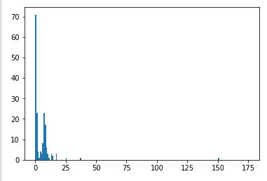
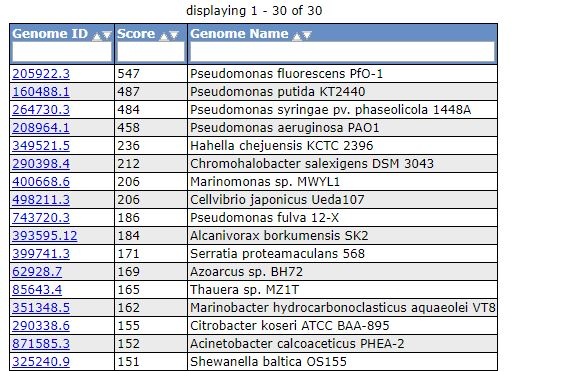
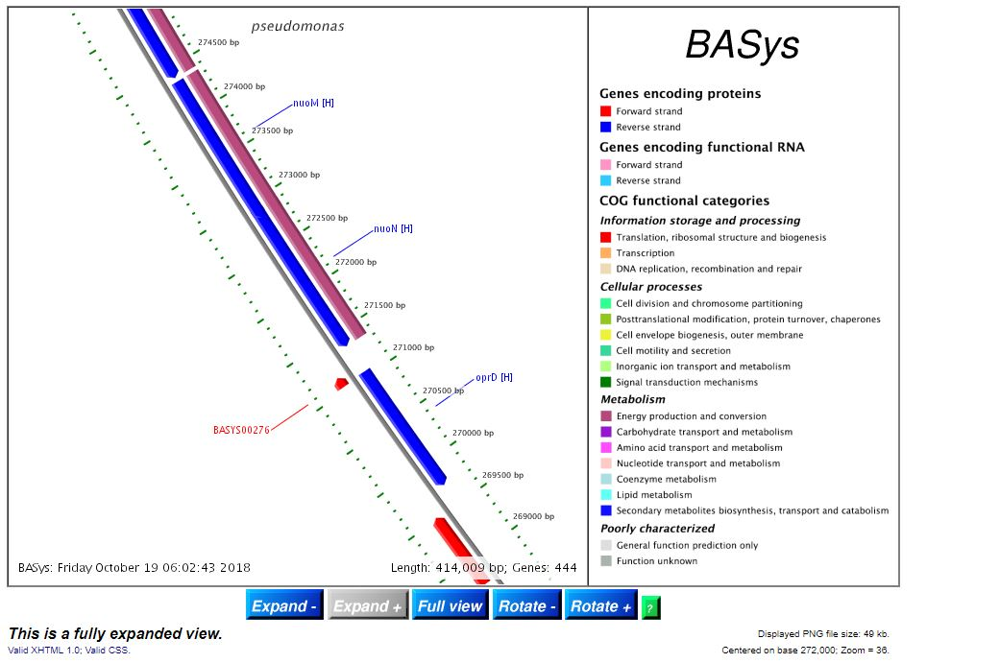
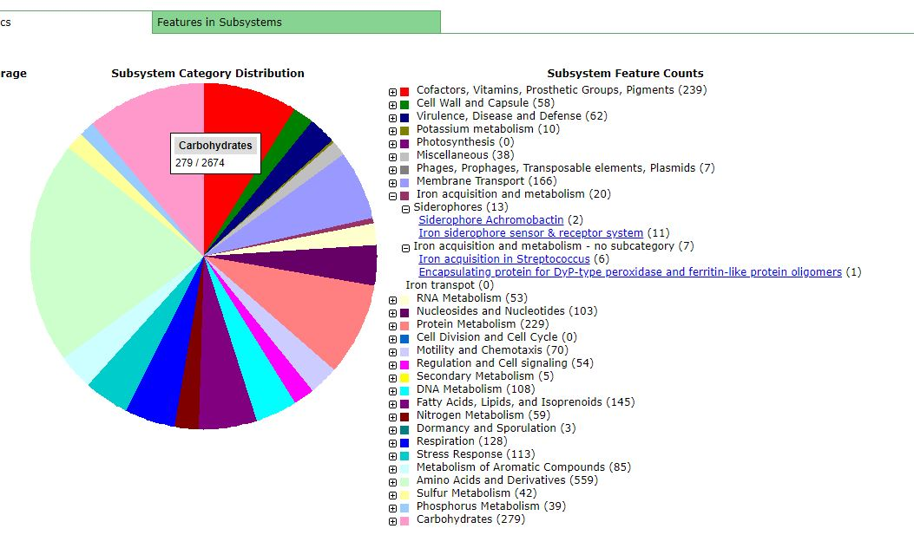
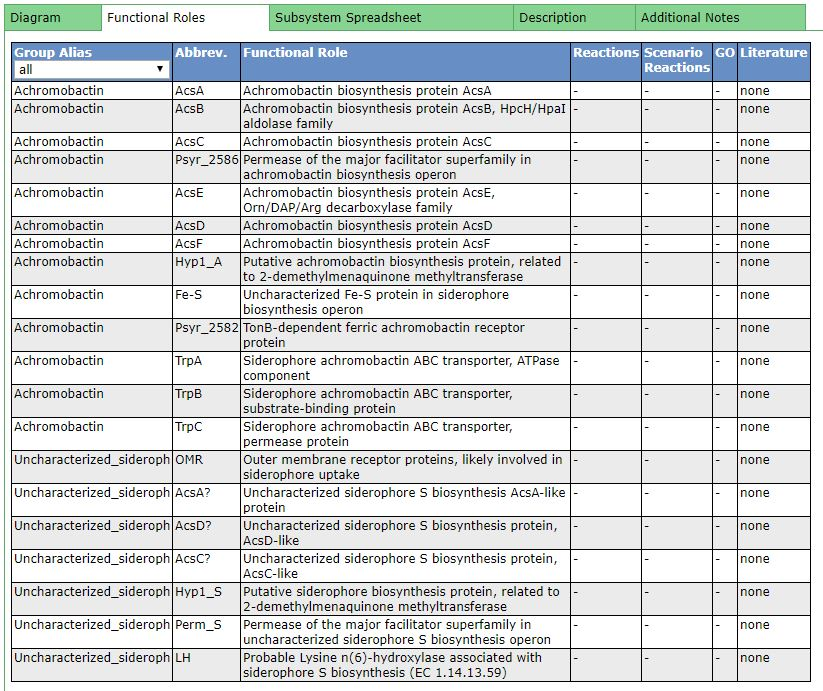
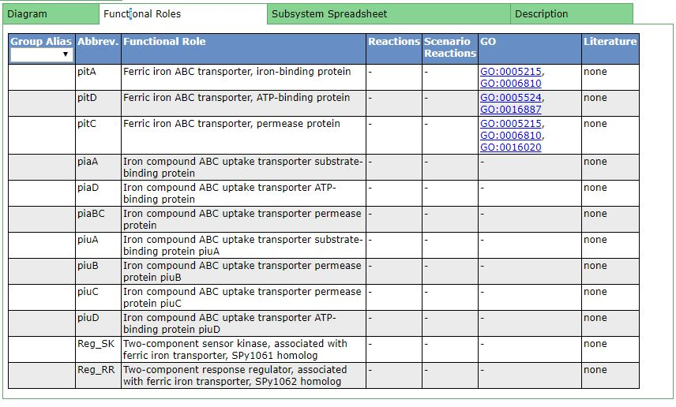

# Genome assembly and analysis

The aim of this project is to assemble a bacterial genome de novo using a combination of long PacBio reads and short Illumina reads. The assembly is then analyzed to extract various quality statistics, identify the genome’s taxonomic origin and obtain two genome annotations via different pipelines.

# Lab8

In this lab, we assemble the bacterial genome from the provided reads. This can take several hours.

```
Command line: /usr/bin/spades.py -1 /data/lab8/illumina_reads_R1.fastq -2 /data/lab8/illumina_reads_R2.fastq –pacbio /data/lab8/pacbio_reads.fastq -t 1 -o /home/be131-09/GIT/Computational-Biology/Lab8
```

*__Q:__* Why do we expect short reads to produce a more fragmented assembly than long reads? Why does a single-molecule sequencing like PacBio have a higher error rate than Illumina?

*__A:__* Assemblies using shorter reads need more reads to cover the whole genome. Consequently, short reads lead to a more fragmented assembly (ie. more contigs) than long reads.

Single-molecule sequencing (SMRT) like PacBio provide longer reads with a higher error rate. Indeed, the sequence uses a single DNA polymerase enzyme with a single molecule of DNA as a template. SMRT uses a zero-mode waveguide (ZMW) to detect nucleotides which are binding to the template. However, ZMW cannot differentiate a nucleotide that enters the well and leaves through diffusion from a nucleotide that actually binds to the template. Therefore, a single run of SMRT contains many errors. To offset this error rate, PacBio use circular concensus sequencing to get multiple reads of the same template. However single-molecule sequencing is still not as accurate as Illumina.


# Lab9 (continuation of Lab8)

Using the assemblies obtained in the previous lab we now extract key statistics and determine the taxonomic origin of the sequence. We will also obatin genome annotations via two different pipelines.

## Running assembly stats

```
be131-09@meowth:~/GIT/Computational-Biology/Lab8$ assembly-stats contigs.fasta scaffolds.fasta
stats for contigs.fasta
sum = 6678635, n = 176, ave = 37946.79, largest = 414008
N50 = 234690, n = 11
N60 = 202142, n = 14
N70 = 154232, n = 18
N80 = 103367, n = 23
N90 = 81286, n = 30
N100 = 128, n = 176
N_count = 0
Gaps = 0
-------------------------------------------------------------------------------
stats for scaffolds.fasta
sum = 6678655, n = 174, ave = 38383.07, largest = 414008
N50 = 234690, n = 11
N60 = 202142, n = 14
N70 = 154232, n = 18
N80 = 103367, n = 23
N90 = 81821, n = 30
N100 = 128, n = 174
N_count = 20
Gaps = 2
```
The numbers are rather self-explanatory. N50 = 234690, n = 11 means 50% of the assembly is contained in the 11 longest read.

*__Q:__* Why is N50 is useful statistic to calculate? Why not just list the mean or median contig length? In your assembly, are scaffolds longer than contigs, or are scaffolds approximately equal to contigs?

*__A:__* The N50 gives an idea of the "completeness" of the assembly. A high N50 contig length suggests the assembly is of good quality, with mainly long reads being used. Conversely, a low N50 means a number of small reads have been combined to build the assembly which is likely to lead to more errors (since the likelihood of a matching is higher for shorter sequences).

Using the mean or the median contig length alone could be misleading. Filling an assembly with many overly short sequences is not ideal, however accurate the reads may be. Therefore it is common practice to remove the shortest contigs from an assembly. Unfortunately, there are not standardized guidelines for this removal. This means two labs working with the same dataset could have different criteria and this would significantly impact the median and the mean. Although not a perfect metric, N50 gives a more accurate measure of the assembly quality since it is less subject to these individual choices and is less likely to change if the original dataset used is the same.

In our assembly, the scaffolds are approximately the same length as the contigs, with the average length varying less than 1.5% between the two. The reason for this low variation is the small number of gaps (2) introduced in the scaffold.


### Extra credit

```
be131-09@meowth:~/GIT/Computational-Biology/Lab8$ grep '>' contigs.fasta
>NODE_1_length_414008_cov_7.740928
>NODE_2_length_378948_cov_10.006665
>NODE_3_length_360689_cov_7.539874
>NODE_4_length_332509_cov_9.114046
>NODE_5_length_327223_cov_9.241629
...
```
Note: additional output lines have been removed for clarity.

A histogram of contigs coverage was plotted in iPython (length of coverage in x-axis, number of occurences in y-axis).



*__Q:__* Is coverage uniformly distributed? Does it look Gaussian? Is it bimodal or trimodal? What explains the presence of contigs with coverage an integer multiple of the mean coverage?

The coverage is far from uniformly distributed. Instead we observe a bimodal distribution with a main peak at 0 and a secondary peak at 7.

Here, we do not observe the presence of contigs with coverage an integer multiple of the mean coverage (14). If we did, this would correspond to regions of the genome that have been duplicated (a common occurence in bacteria). In addition, interrupted genome replication could also explain an integer multiplication of the coverage. Indeed, sequences close to the origin of replication would have been duplicated but not the rest of the genome.


## Identifying the taxon from which the genome originated

To identify the genome origin we focused on the hypervariable regions of the 16S ribosomal RNA subunit. We ran the following commands using Python to extrate the location of all rRNA genes and then extract those relative to the 16S ribosomal unit.

```
Input:
! rna_hmm3.py -i contigs.fasta -o rRNA_locate
! sed -i '/16S/!d' rRNA_locate
! cat rRNA_locate

Output:
NODE_23_length_103367_cov_10.081286	rna_hmm3	rRNA	35531	37075	0	+	NA	16S_rRNA
NODE_18_length_154232_cov_9.584186	rna_hmm3	rRNA	124542	126086	0	+	NA	16S_rRNA
NODE_5_length_327223_cov_9.241629	rna_hmm3	rRNA	46286	47830	0	+	NA	16S_rRNA
NODE_6_length_298784_cov_8.918606	rna_hmm3	rRNA	13926	15470	0	+	NA	16S_rRNA
NODE_4_length_332509_cov_9.114046	rna_hmm3	rRNA	137012	138556	0	-	NA	16S_rRNA
NODE_2_length_378948_cov_10.006665	rna_hmm3	rRNA	348500	350044	0	+	NA	16S_rRNA
```
6 reads matched to the 16S subunit.

We then stored these matches to a specific FASTA file.

```
! bedtools getfasta -fi contigs.fasta -bed rRNA_locate > 16S_rRNA.fasta
```

We used the Ribosomal Database Project’s SeqMatch tool to identify the origin of the genome using the created FASTA file. Here are the results:

```
domain Bacteria  (0/20/3065908) 
    phylum "Proteobacteria"  (0/20/1033824) 
        class Gammaproteobacteria  (0/20/445158) 
            order Pseudomonadales  (0/20/121354) 
                family Pseudomonadaceae  (0/20/78049) 
                    genus Pseudomonas  (0/20/69417)
                            S000028105     not_calculated 1.000 0616  uncultured bacterium; LES-154; AJ344206
                            S000622918     not_calculated 1.000 0574  gamma proteobacterium NH14; AB232025
                            S000622920     not_calculated 1.000 0574  gamma proteobacterium NH16; AB232027
                            S000622922     not_calculated 1.000 0574  gamma proteobacterium NH18; AB232029
                            S000622924     not_calculated 1.000 0574  gamma proteobacterium NH20; AB232031
                            S000622926     not_calculated 1.000 0574  gamma proteobacterium NH22; AB232033
                            S000622927     not_calculated 1.000 0567  gamma proteobacterium NH23; AB232034
                            S000622930     not_calculated 1.000 0574  gamma proteobacterium NH26; AB232037
                            S000622931     not_calculated 1.000 0574  gamma proteobacterium NH27; AB232038
                            S000622935     not_calculated 1.000 0574  gamma proteobacterium NH32; AB232042
                            S001263422     not_calculated 1.000 0506  Pseudomonas fluorescens; FPH02033; AB478373
                            S001263423     not_calculated 1.000 0506  Pseudomonas fluorescens; FPH00844; AB478374
                            S001263424     not_calculated 1.000 0506  Pseudomonas fluorescens; FPH02106; AB478375
                            S001263425     not_calculated 1.000 0506  Pseudomonas fluorescens; FPH00717; AB478376
                            S001263426     not_calculated 1.000 0506  Pseudomonas fluorescens; FPH00767; AB478377
                            S001263427     not_calculated 1.000 0506  Pseudomonas fluorescens; FPH02214; AB478378
                            S001263428     not_calculated 1.000 0506  Pseudomonas fluorescens; FPH02131; AB478379
                            S001263429     not_calculated 1.000 0506  Pseudomonas fluorescens; FPH00716; AB478380
                            S001263430     not_calculated 1.000 0506  Pseudomonas fluorescens; FPH00703; AB478381
                            S001263431     not_calculated 1.000 0506  Pseudomonas fluorescens; FPH00711; AB478382
```

The S_ab score returned for all the results is of 1 which suggests the provided reads come from the Pseudomas genus.


## Genome annotation and Research

Although Ribosomal database project's SeqMatch tool only led us to the genus level of the genome, we used closest neighbor tool in RAST to infer the species. We assumed that the organism is Pseudomonas fluorescens PfO-1 based on the RAST result shown below. We focused on the iron metabolism of Pseudomonas Fluorescens. Specifically, how the metal gallium would disrupt this process.



### Pseudomonas Fluorescens Summary 

Pseudomonas fluorescens is a type of rod-shaped bacterium. It has multiple flagella and undergoes versatile metabolism. It usually inhabits in soil and water. Some strains of Pseudomonas Flurescens are capable of using nitrate instead of oxygen during cellular respiration. One thing P. Flurescens is famous for is its ability to produce mupirocin. The antibiotic can be used to treat multiple skin, ear, and eye disorder. It is worth pointing out that fluorescent pseudomonads' ability to degrade toxic chemicals and their helpful interactions with plants have attracted many researchers. Three of its strains SBW25, Pf-5 and PfO-1 have been sequenced (PfO-1 is the one we're dealing with here).


### Iron Metabolism Summary

Fe metabolism is a significant vulnerability of infecting bacteria both because organisms require Fe for growth, and it is critical in the pathogenesis of infections. To combat invading bacteria, plants or animals usually have mechanisms to withold iron. Some even use Nramp1 (a protein) to generate reactive oxygen species to kill the pathogens. Under iron starvation, Pseudomonas fluorescens produces a second iron-chelating compound which was purified and identified by spectroscopy, HPLC and 1H-NMR to be salicylic acid.


### Iron Metabolism of Pseudomonas Fluorescens


Multiple genes are involved in the iron metabolism of pseudomonas fluorescens. For example, in Basys library, the gene BASYS00277.1 encodes NDH-1, which shuttles electrons from NADH, via FMN and iron- sulfur (Fe-S) centers, to quinones in the respiratory chain.



In RAST annotation, Iron acquisition and metabolism includes four categories: Siderophore Achromobactin, Iron siderophore sensor & receptor system, Iron acquisition in Streptococcus, and  Encapsulating protein for DyP-type peroxidase and ferritin-like protein oligomers.



The first paper we cited investigated the effect of pyoverdines synthesized by pseudomonas fluorescens on plants' defense system in iron-deficient conditions. When iron is limited, pyoverdines, the ferric iron chelators are excreted by pseudomonas fluorescens to acquire iron in the soil. Pyoverdines are not always harmful for plants' health, they may even ameliorate plant growth. 

The paper investigated the effects of pyoverdine from Pseudomonas fluorescens on Arabidopsis (Arabidopsis thaliana) under iron-sufficient or iron-deficient conditions. The paper found that the favorable effect of pyoverdine for plants under iron-deficient conditions was damaged in iron-regulated transporter1 and ferric chelate reductase2 knockout mutants. They also identified the reason why this is prioritized over immuniy. The transcription factor HBI1 was over expressed. It is a key node for the cross talk between growth and immunity. 

However, in order to mimick the situation where pseudomnas fluorescens excreting pyoverdine, the researchers used a compound called apo-pyoverdine, the iron-free structure of pyvoerdine. We think that this introduce additional variables. Furthermore, it is not useful for investigating the real interactions between pseudomnas fluorescens and arabidopsis. The experiment can be improved by identifying the gene that encodes pyoverdine and engineering the specific gene.

Pyvordines are siderophores excreted by bacteria. From RAST results, we can identify the gene easily. Below is a summary of the subsystem Siderophore Achromobactin of pseudomonas fluorescens.




<br>
The second paper we cited investigated gallium's disruption of Pseudomonas aeruginosa's iron metabolism. It has been introduced in the previous paragraphs that Fe metabolism is a key vulnerability of bacteria and is critical in the pathogenesis of infections. Since gallium is chemically similar to iron, it can substitute for Fe in some situations and suppress processes that depend on Fe. The paper found that Ga inhibits Pseudomonas aeruginosa growth.

However, the author did not identify the specifc paths or processes that Ga inhibits. Since both Pseudomonas aeruginosa's and Pseudomonas Fluorescens's genome is already known, we think it would be a good idea to compare Ga's effect on the two similar organisms. By mapping the effect to the gene expression difference, both the inhibition process and iron metabolism can be better understood.




#### References:

Trapet, Pauline, et al. _The Pseudomonas fluorescens siderophore pyoverdine weakens Arabidopsis thaliana defense in favour of growth in iron-deficient conditions._ Plant Physiology. 2016;171(1):675-693; DOI: [10.1104/pp.15.01537]

Kaneko Y, Thoendel M, Olakanmi O, Britigan BE, Singh PK. _The transition metal gallium disrupts Pseudomonas aeruginosa iron metabolism and has antimicrobial and antibiofilm activity._ J Clin Invest. 2007;117(4):877-88; DOI: [10.1172/JCI30783]
